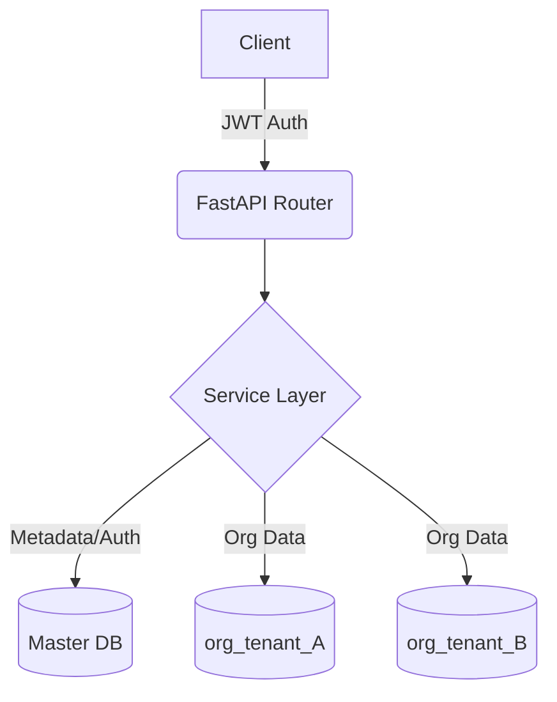

# Backend Intern Assignment – Organization Management Service

A high-performance **Multi-tenant Organization Management Service** built with **Python 3.12** and **FastAPI**. It features a robust architecture where each organization's data is isolated in dynamically created MongoDB collections, managed via a central master database.

## 1. Project Overview

This backend service provides APIs to manage organizations in a multi-tenant environment. Unlike shared-table approaches, this system implements **Database-per-Tenant (via Collections)** isolation strategy:
- A **Master Database** holds global metadata and authentication credentials.
- **Dynamic Collections** (`org_<name>`) are created programmatically when an organization is registered.
- **JWT Authentication** secures administrative endpoints, ensuring isolation.

## 2. Architecture Overview

The system uses a **Clean Class-Based Architecture** with clear separation of concerns:

- **Master Database (`master_metadata`)**: Stores `organizations` collection containing metadata (admin email, hashed password, mapped collection name).
- **Tenant Collections**: Each organization gets a dedicated collection named `org_{sanitized_org_name}` to store its specific data.
- **Authentication Flow**: Admins log in to receive a JWT containing their `org_name`. This token is used to scope all subsequent requests to the correct tenant collection.



## 3. Tech Stack

- **Framework**: FastAPI (Async)
- **Database**: MongoDB (via `motor` async driver)
- **Authentication**: JWT (`python-jose`) + `passlib` (Bcrypt hashing)
- **Validation**: Pydantic v2
- **Configuration**: `pydantic-settings`
- **Rate Limiting**: `slowapi`
- **Testing**: `pytest`, `httpx`

## 4. Folder Structure

```
├── app/
│   ├── api/
│   │   ├── v1/
│   │   │   ├── auth.py       # Admin login endpoints
│   │   │   └── org.py        # Organization CRUD endpoints
│   │   └── deps.py           # Dependency injection (Auth)
│   ├── core/
│   │   ├── config.py         # Environment settings
│   │   └── logging.py        # Centralized logger
│   ├── db/
│   │   └── mongodb.py        # Singleton Database Manager
│   ├── models/
│   │   ├── auth.py           # Auth Pydantic models
│   │   └── org.py            # Organization Pydantic models
│   ├── services/
│   │   ├── auth_service.py   # Login & Hashing logic
│   │   └── org_service.py    # Org Management & Migration logic
│   └── main.py               # App entry point
├── tests/                    # Pytest suite
├── .env                      # Environment variables
├── Dockerfile                # Container definition
└── requirements.txt          # Dependencies
```

## 5. API Documentation

### Organization Management

| Method | Endpoint | Purpose | Body | Auth |
| :--- | :--- | :--- | :--- | :--- |
| **POST** | `/api/v1/org/create` | Register new organization | `{"organization_name": "...", "email": "...", "password": "..."}` | No |
| **GET** | `/api/v1/org/get` | Get org details | `?organization_name=...` | No |
| **PUT** | `/api/v1/org/update` | Update org & **Migrate Data** | `{"organization_name": "...", ...}` | **Yes** |
| **DELETE** | `/api/v1/org/delete` | Delete org & drop collection | `?organization_name=...` | **Yes** |

### Authentication

| Method | Endpoint | Purpose | Body | Auth |
| :--- | :--- | :--- | :--- | :--- |
| **POST** | `/api/v1/admin/login` | Login & Get Token | `{"email": "...", "password": "..."}` | No |

## 6. Authentication Flow

1. **Login**: Admin sends email/password to `/admin/login`.
2. **Verification**: System checks `master_metadata.organizations` for the email and verifies password hash.
3. **Token Issue**: A JWT is signed containing `sub` (email) and `org_name`.
4. **Context**: For protected routes (`PUT`, `DELETE`), the `org_name` from the JWT implies the "current tenant context", ensuring admins can only modify their own organization.

## 7. Dynamic Organization Handling

- **Creation**: When `/org/create` is called, the service:
  1. Checks for duplicates in Master DB.
  2. Inserts metadata.
  3. **Programmatically creates** the collection `org_<sanitized_name>` by inserting a dummy init document.
  
- **Renaming & Migration**: If an org is renamed via `/org/update`:
  1. A new collection is created.
  2. Data is **migrated** (copied) from the old to the new collection.
  3. Metadata is updated.
  4. The old collection is **dropped**.

## 8. Extra Features Implemented

- **Rate Limiting**: Integrated `slowapi` checks (e.g., 5 logins/min, 10 writes/min).
- **CORS Middleware**: Configured for cross-origin resource sharing.
- **Structured Logging**: Centralized logger usage instead of print statements.
- **Environment config**: Settings loaded strictly via `.env`.
- **Async Implementation**: Fully async DB operations using `motor`.
- **Sanitization**: Organization names are sanitized (spaces to underscores, lowercase) for safe collection naming.

## 9. Design Decisions & Trade-offs

- **Collection-per-Tenant**: Chosen for strong data isolation while keeping keeping infrastructure complexity lower than "Database-per-Tenant". Scalable up to thousands of collections.
- **Migration Strategy**: Renaming an organization triggers a full data copy.
  - *Trade-off*: Expensive for very large datasets.
  - *Mitigation*: Implementation uses async iteration, but for massive data, a background job queue (Celery/background_tasks) would be better.
- **Singleton DB**: The `DatabaseManager` logic ensures a single connection pool is reused across the lifecycle.

## 10. Setup & Run Instructions

### Prerequisites
- Python 3.12+
- MongoDB (Running locally or on Atlas)

### Local Setup
1. **Clone & Install**:
   ```bash
   pip install -r requirements.txt
   ```
2. **Configure Environment**:
   Create a `.env` file:
   ```ini
   MONGO_URL="mongodb+srv://..."
   MONGO_DB_NAME="multi_tenant_wedding"
   SECRET_KEY="your_secret_key"
   ```
3. **Run**:
   ```bash
   uvicorn app.main:app --reload
   ```
4. **Docs**:
   Visit `http://localhost:8000/docs` for the interactive Swagger UI.

### Docker
```bash
docker build -t org-service .
docker run -p 8080:8080 org-service
```

## 11. Assumptions

- Admin Email is unique across the system.
- An admin belongs to exactly one organization (mapped at creation).
- Data migration during renaming is synchronous (acceptable for assignment scope).
- "Master Database" refers to the main logical database holding the `organizations` collection and all tenant collections (unless separated by advanced config).
